

    <h1>TripTailor</h1>

    

        
    

    

        
    

    Written for:

    

        Dr. Raja Manzar Abbas, <i>PhD., M.Sc., B.Sc.,</i> 
        <i>Professor, Principal Investigator</i> 
        Faculty of Engineering and Applied Sciences 
        <i>Memorial University of Newfoundland</i>
    

    

        Mr. Alam Shahbad, <i>B.Eng,</i> 
        <i>Teaching Assistant, M. Eng Student</i> 
        Faculty of Engineering and Applied Sciences 
        <i>Memorial University of Newfoundland</i>
    

## Team

    

        
        <a href="https://github.com/WyrdWyn4" target="_blank">
            
Waleed Khan Sherwani

        </a>
    

    

        
        <a href="https://github.com/allymreid" target="_blank">
            
Ally Mackenzie Reid

        </a>
    

    

        
        <a href="https://github.com/MiguelPond" target="_blank">
            
Miguel Diego Pond

        </a>
    

    

        
        <a href="https://github.com/Leo-Gilbert" target="_blank">
            
Léo Gilbert

        </a>
    

    

        
        <a href="https://github.com/jordyob03" target="_blank">
            
Jordyn Elizabeth O'Brien

        </a>
    

    

        
        <a href="https://github.com/AbdulTur" target="_blank">
            
Abdulaziz Turonov

        </a>
    

    

        
        <a href="https://github.com/noahjrc" target="_blank">
            
Noah James Colbourne

        </a>
    

    

        
        <a href="https://github.com/napierce" target="_blank">
            
Naomi Ann Pierce

        </a>
    

    

        
        <a href="https://github.com/MitchRoberts" target="_blank">
            
Mitch C. Roberts

        </a>
    

## Introduction

TripTailor is a platform designed to revolutionize the way people plan and share travel experiences. It aims to simplify the travel planning process by combining personalization, community-driven content, and intuitive features. The primary objective of the project is to provide users with a seamless way to create, share, and explore customized trip itineraries tailored to their unique interests, demographics, and budgets.

The platform allows users to create itineraries that function like social media posts. These itineraries include all essential details such as destination, events, timings, and budget. To ensure they are discoverable, an intuitive tagging system allows users to categorize itineraries based on key attributes like destination, activity type, activity level, and travelers. This system not only enhances search functionality but also helps users easily find itineraries and events that align with their preferences.

Overall, TripTailor is designed to streamline the travel planning process, making it more efficient and tailored to individual needs. The combination of personalization, community engagement, and streamlined functionality ensures that travel planning becomes an enjoyable, collaborative, and highly tailored experience.

## Technologies

### Front-end

#### Structure

The frontend of TripTailor follows a microservice-based structure, where each major feature or functionality is implemented as an independent service, like the backend architecture. Key services in the frontend include components for user authentication, itinerary creation, search, tag filtering, profile management, and feed display.

> This modular approach ensures that each feature is self-contained and can function independently while adhering to a unified design system, maintaining consistent user experience across the application. By decoupling the frontend into individual services, we made development, testing, and debugging more efficient. For instance, the itinerary grid and navigation bar profile components were built as standalone modules, interacting with the backend through clearly defined APIs. 
{: .prompt-tip }

> This structure also minimizes the risk of system-wide failure; if one service encounters an issue, the rest of the front end can continue functioning.
{: .prompt-warning }

> Furthermore, this architecture ensures the frontend is highly scalable, as each service can be updated, replaced, or expanded independently without disrupting the overall application.
{: .prompt-info }

#### Languages and Tools

**React.js**
: React was chosen for its support of component-driven and microservice-friendly development. Its modular structure allowed us to build isolated, reusable components for services like itinerary grids, navigation bar, and modals. React’s virtual DOM ensures efficient rendering, which is essential for a highly interactive application like TripTailor.

**JavaScript (ES6)**
: JavaScript served as the primary language for implementing the frontend logic. ES6+ features such as arrow functions, async/await, and destructuring were used to write modern, concise, and efficient code. JavaScript powered dynamic user interactions, API calls, and state management for each microservice.

**CSS**
: CSS was used to style each service independently while maintaining a cohesive design across the application. Modular CSS techniques allowed for isolated styles within each service, ensuring that changes in one module didn’t affect others. Responsive design principles ensured the application performed well on various devices.

### Back-end

#### Structure

The backend of TripTailor follows a microservices structure, where each important feature is split into different services and responsible for their part of the backend logic. The services featured in TripTailor back-end include the main, authentication, profile, search, itinerary, feed and save. The roles of each service will be discussed further within the report in detail.

> The primary motivator for choosing microservice architecture was the decoupling of the backend. This allows for different features of the application to be stand alone and independent, making testing and integrating easier as well as keeping the application more failure proof, as because each service is independent if one fails, the rest of the application does not crash, isolating the error.
{: .prompt-tip }

>The services are connected to a single overarching database, which in the future, if demand necessitates, could be scaled into multiple different databases for different services, turning the project into a true microservices architecture.
{: .prompt-info}

#### Languages and Tools

**Golang**
: The language that was chosen for the backend was Golang or Go. This was done to due to Go’s significant performance advantage compared to regular backend languages such as Python, Ruby, JavaScript, C# and Java. However, the syntax of Go is also less complex compared to a language like C++. Thus, due to ease of syntax and incredible performance, Go was chosen. Additionally, core features of Go are the goroutines, which allow for easy and simple parallelism of process, allowing for the backend and consequently rest of the TripTailor application to be scalable.

**Gin**
: Go’s Gin framework was chosen for handling HTTPS requests and building RESTful APIs. This was done due to quality of life and ease of development reasons, as the framework out of the box comes in with methods for creating REST API. Further since Gin is an official Go framework, the methods that are contained within the framework not only are the most used methods for backend development but also are clean and performant, which once again allows the backend to be scalable.

**Docker**
: Docker was chosen as a tool to keep the backend contained in one place for ease of development. The other main motivator was to make sure all services are run in an identical environment, in the same operating system, with the same package and language versions, which allows developers, who are writing code on different machines, to run the backend in an identical manner. Each service has its own docker container, where the service is run. This allows for easier troubleshooting and testing of code, making the backend more error proof and once again keeps the backend scalable, especially when it comes to deploying the backend in cloud services, which utilize Kubernetes and docker for environment control, allowing for a 1 to 1 transition from development to production.

### Database

#### Database Initialization and Connection Management

##### PostgreSQL
The database system is built using PostgreSQL, a powerful, open-source relational database, and is deployed in a Docker container to ensure portability and ease of setup. Additionally, PgAdmin is utilized as a graphical user interface for database management, providing an accessible way to interact with and monitor the database.

> PostgreSQL serves as the backbone of the application’s data management. It was chosen due to its relational structure and extensibility, all of which complement a normalized schema and ensure data consistency, while offering advanced features. In addition, PostgreSQL’s JSONB Support allows storage and querying of semi-structured data, such as arrays, which enables very efficient queries.
{: .prompt-info }

##### PgAdmin
PgAdmin was included in the setup for management, to provide Visualization Tools and a User-Friendly Interface, to allow us to inspect and debug data handling mismatches.

Upon deployment, database tables and schemas are initialized using custom scripts. Docker ensures the migration process runs seamlessly during container startup, maintaining schema consistency.

> Through customized scripts, the database connection is established, and the connectivity is verified. Given that the provided connection string is valid, and the database is accessible, the application signals readiness for subsequent operations. A connection object is reused throughout the application to avoid redundant connections and is properly closed at the end to prevent resource leaks.
{: .prompt-info }

#### Table Structure and Schema

The application consists of seven core tables:

| Table Name      | Description                                                                                       |
|-----------------|---------------------------------------------------------------------------------------------------|
| **Users Table** | Stores essential information about the platform's users.|
| | Key features include social attributes like Followers and Following (stored as arrays),|
| | Profile customization through ProfileImage and CoverImage (referencing the images table),|
| | and user contributions tracked through the Boards and Posts field.|
| **Itineraries Table** | Stores travel plans, connecting them with events and related posts. |
| **Events Table** | Contains details of individual activities within an itinerary. |
| | Events support multimedia through EventImages (referencing the images table) |
| | and are linked to ItineraryId, ensuring activities are part of specific travel plans. |
| **Posts Table** | Records user-generated content, enabling interaction through likes and comments. |
| | Functionalities include creating a link between travel plans and user posts, |
| | association with links to an Itinerary, categorization linking using Boards, |
| | and enabling user engagement using Likes and Comments. |
| **Boards Table** | Organizes posts into thematic collections, akin to virtual bulletin boards. |
| **Images Table** | Stores multimedia assets for various purposes across the application. |
| | ImageData holds binary image content, while Metadata provides context, |
| | such as resolution or associated entities. |
| **Comments Table** | Manages user feedback and discussions related to posts or itineraries. |

#### Table Relationships

The Tables are connected with the relationships as outlined below:

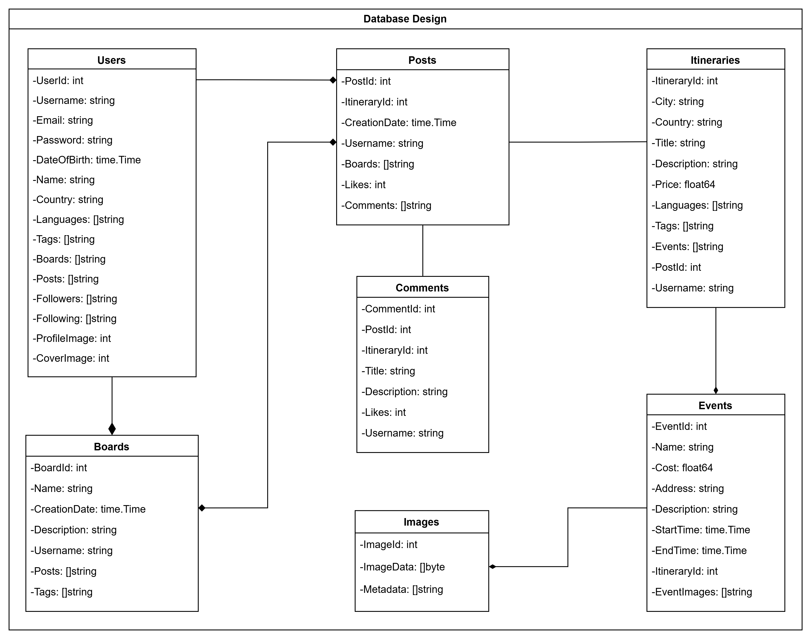

## Project Management

For this project Agile Scrum methodologies were used to manage the project. Jira was used to manage a backlog of tasks and week-long sprints were used.

**Jira**
: The team utilized Jira as the primary tool for managing the project backlog and tracking progress. Tasks were categorized by priority and complexity, and user stories were created to ensure each task was tied to a specific feature or functionality.

**Discord**
: Communication was facilitated through Discord, which provided a centralized platform for discussions, announcements, and quick issue resolution.

**GitHub**
: The codebase was managed on GitHub, with pull requests and code reviews ensuring quality and consistency across the development process.

**Confluence**
: Documentation, including specifications and meeting notes, was maintained on Confluence to keep everyone informed and aligned.

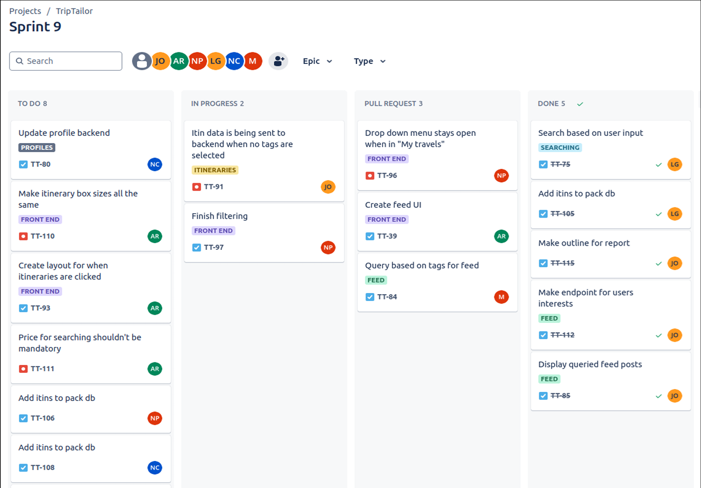

## Testing

Performing Testing on new code was performed manually, following strict adherence to a written procedure, utilizing White Box testing. New functionalities under test were prodded for handling various valid and invalid inputs, and then the associated log output of the container would be contrasted against the stored database values.

> An enumerated procedure for testing, aligning with common patterns users will perform in sequence caught many emergent bugs that only occurred when trying edge cases, attempting to ‘break’ the application, and stacking various tests in different orders.
{: .prompt-tip }

> These faults were routed and eliminated fairly frequently. Requiring multiple successful Pull-Request reviews aided in fault detection. Approaching the website as a user and being aware of testing biases, documenting errors, and precise replication steps, allowed manual testing to be as successful as it was.
{: .prompt-info }

## CI/CD

CI/CD was implemented via GitHub Actions and the pipeline performs the following: building and launching the application successfully, running all implemented unit tests in the Golang backend, and a Virtual Code Review that would notice many well-known poor patterns and then successfully, selected for manual testing.

The pipeline begins with a comprehensive build process. This step compiles and packages the application to ensure all components are functional and compatible. Docker ensures that every service operates in a consistent environment, eliminating issues caused by varying dependencies across machines.

> Successfully completing this step guarantees that the application is free of critical build-time errors and is ready for subsequent testing phases.
{: .prompt-tip }

Following the build, the pipeline executes all unit tests implemented for the Golang backend. These tests validate the core functionalities of individual modules, such as user authentication, itinerary management, and API endpoint responses.

The unit tests also cover edge cases and error scenarios, ensuring the backend handles unexpected inputs gracefully. Automated testing is a vital stage in maintaining the reliability and performance of the system as new features are added.

> Any test failures result in immediate pipeline halts, preventing defective code from being integrated further.
{: .prompt-warning }

In addition to testing, the CI/CD pipeline includes a virtual code review step. This process leverages automated static code analysis tools to evaluate the code for known anti-patterns, inefficiencies, and violations of best practices.

> The virtual review highlights issues such as unsafe concurrency practices, unoptimized queries, or unused variables in the Golang backend.
{: .prompt-tip }

> The findings are summarized into reports, enabling developers to address potential problems proactively before merging changes.
{: .prompt-info }

> This was sufficient for initially filtering out all PRs that have glaring faults and allowing the rest to be manually tested.
{: .prompt-info }

## Services

### Main Service

#### Overview

The Main-service is a core backend component, serving and facilitating the essential operations of the application, including database management, data population, and the provision of RESTful endpoints for client interactions.

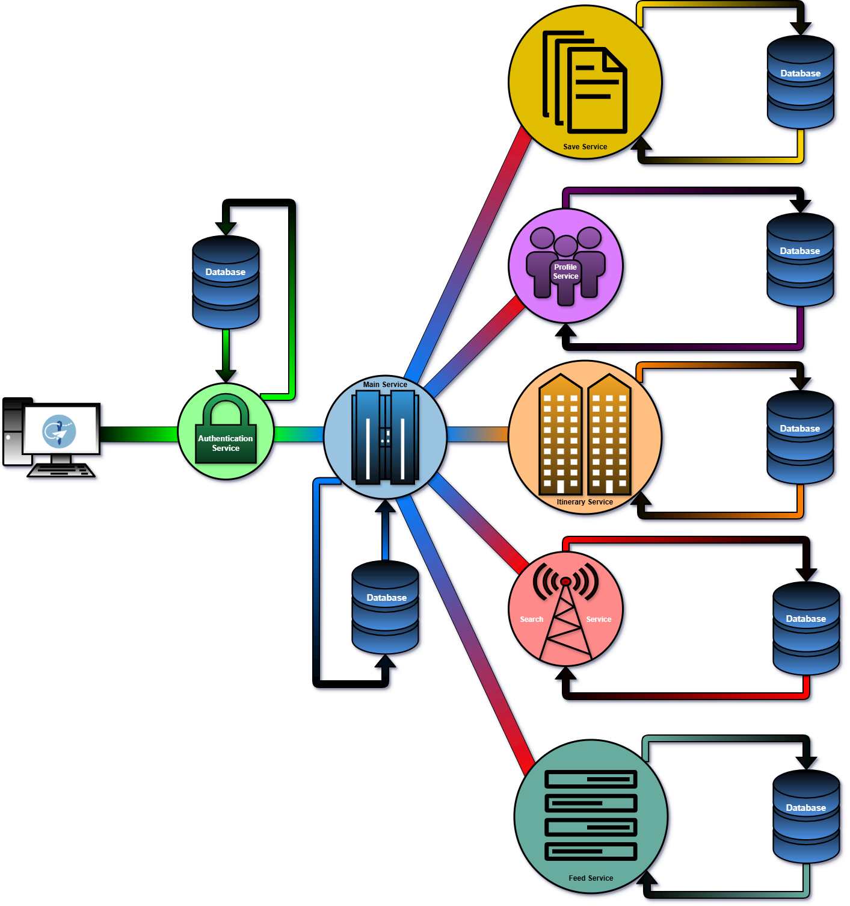

#### Database Management

One of the primary responsibilities of the Main-service is managing the PostgreSQL database.

> Upon startup, the service establishes a connection to the database container using a preconfigured connection string, which is critical for ensuring all subsequent operations are executed seamlessly.
{: .prompt-info }

#### REST API Exposure

The Main-service exposes several RESTful endpoints to facilitate interaction with the database and backend functionality.

> Key endpoints include /users, which handles user-related requests, and /images/, which manages image retrieval operations. A test endpoint, /hello, serves as a basic health check to confirm the server's availability.
{: .prompt-info }

#### Data Packing

A significant feature of the Main-service is its ability to pack the database with predefined datasets.

> Utility functions defined in db_packing_utils.go enable the service to process JSON files and local directories, transforming raw data into structured database entries.
{: .prompt-tip }

> For instance, the PackUsersFromJSON function reads a JSON file containing user data, parses the records, and inserts them into the user’s table. Similarly, PackImagesFromLocal reads image files from a specified directory, converts them into byte arrays, and uploads them to the database with associated metadata.
{: .prompt-info }

#### Server Startup and Workflow

The execution of the Main-service begins with main.go. Upon startup, the service establishes a connection to the database using a connection string, ensuring the database is ready for subsequent operations.

After successful connection, the service initializes the database by deleting existing tables, creating new ones, and seeding data.

> Once the database is set up, the service registers HTTP handlers for various endpoints and starts the HTTP server on port 8080.
{: .prompt-info }

### Authentication Service

#### Overview

The authentication service handles the backend operations of signup and signin features of the application.

> The authentication service makes sure that only authenticated users are allowed within the application. Non authenticated users are restricted from accessing any pages or features of TripTailor other than the signup and signin feature.
{: .prompt-info}

> This ensures the security of TripTailor and disallows any unwanted personnel from accessing the application.
{: .prompt-tip }

#### Signup

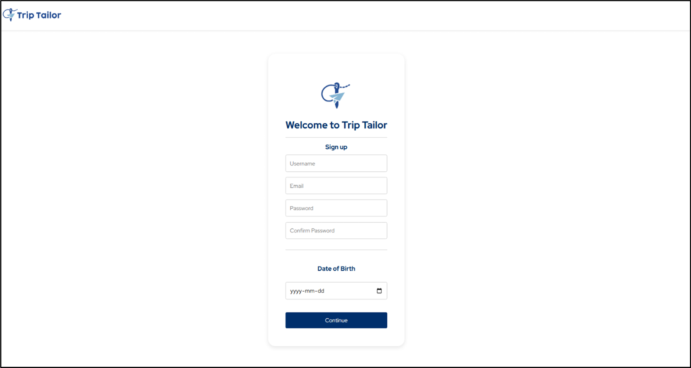

The signup page is responsible for creating user credentials for accessing TripTailor. As can be observed from the above figure, the signup pages take the following user credentials, username, email, password confirm password and date of birth.

The username is the primary user identifier at the backend, the email is taken with the intent of in the future implementing email verification and password recovery steps for the authentication service to bolster the app security.

The password field has several requirements that need to be met for a password to be considered valid and secure. The date of birth field is taken for later usage by the application.

> The password must be 8 characters long, should include at least 1 upper case, one lower case letter, a number and a special character, like an exclamation mark, an underscore and so on.
{: .prompt-info}

> These password requirements ensure that hackers cannot simply guess the password and enter. The confirm password field makes sure the user repeats their password and is satisfied with it. 
{: .prompt-tip}

> Once the fields are completed and the user presses the continue button, submitting their information. This sends the data through a REST API, to the authenticated service “/signup” endpoint, the service is currently set up to listen on port 8081.
{: .prompt-info}

Once the backend receives the user data, the password is encrypted using Go’s bcrypt method, to turn the password into an encrypted hash, which gets stored in the database along with the rest of the user information.

The data is stored in the users table in the database. Further the username is taken and using JWT standard and the username, an encrypted access token is created.

> Once the backend process is completed without errors a confirmation message, with the 200 status and the access token are sent as the response of the API. The access token is stored within the local storage in the client, which allows the user to access the application.
{: .prompt-info}

> At each page and request throughout the application, the access token is sent to the backend in order to verify the validity of the users, if found invalid, backend sends a 500 unauthorized response, which clears the local storage to get rid of the token and navigates the user to the signin page.
{: .prompt-info}

#### Sign In

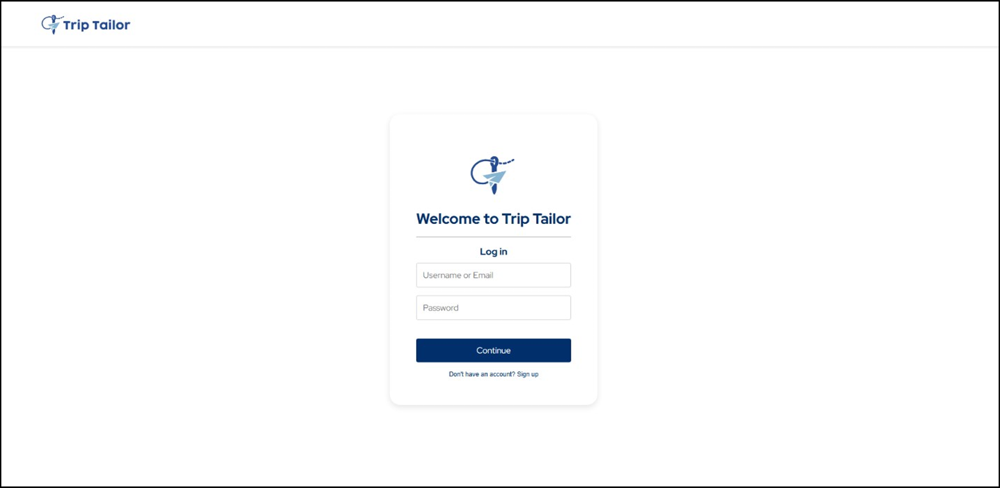

The sign in page handles the user sign in. The page has a username and password fields. Once the sign in form is submitted, the data is sent to the /signin endpoint within the authentication service in the backend.

The username is extracted, and the provided password is hashed using Go’s bcrypt, after which the hashed password is compared to the hashed password stored in the database for the given username.

> If the passwords match, the 200 status, confirmation message and the access token, which is used and created the same way as described in the signup section, are sent back to the client as the backend response. After which the token is stored in local storage and the user is navigated to the home page of TripTailor.
{: .prompt-info}

### Profile Service

#### Overview

The Profile Service handles the creation and updating of user profiles. Users can add their name, languages, and country of residence to their account. Users also select tags for topics they are interested in.

#### Profile Creation/Update

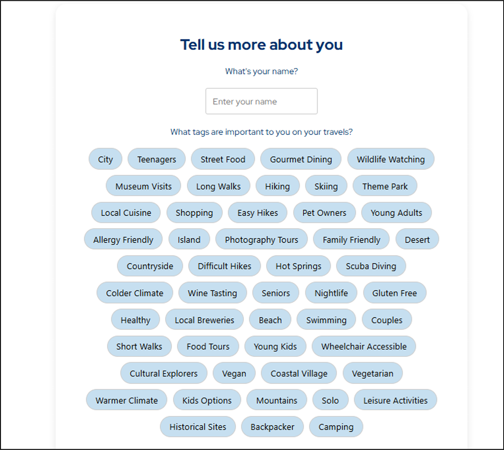

When creating a profile, a user will enter their name to display it on their profile; this is not a mandatory field.

> Users must also select tags for trip topics they are interested in; this is mandatory, and users must select at least three tags.
{: .prompt-info}

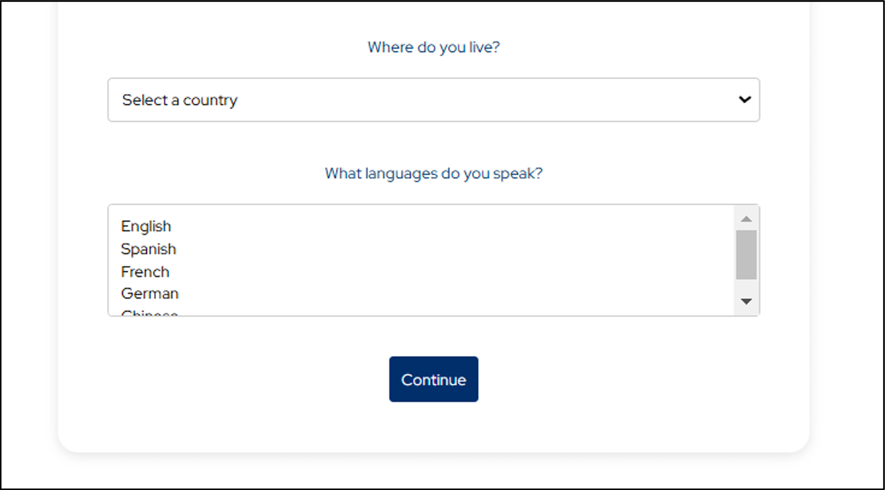

> Users must then select their country of residence, as this is a mandatory field for profile creation, and users must also select the language/languages they speak as this is a mandatory field.
{: .prompt-info}

After all this is entered/selected, users can press continue, and then profile creation will be complete.

> To update profile information, such as adding or removing tags, changing the name, country of residence, or languages spoken, users can navigate to the account settings page. This page displays a screen similar to the profile creation page. Users can modify their information and press save to update their profile.
{: .prompt-info}

### Itinerary Service

#### Overview

The itinerary service handles the creation, storage and retrieval of itineraries from the database. Users can create and post their own itineraries as well as search and view itineraries posted by other users. The itinerary service is needed to ensure all of this can be done.

#### Itinerary creation

When the user fills out the itinerary creation page and press submits an API will handle the transfer of information from the front end to the backend. The backend will parse the information accordingly and add the itinerary, events and photos to the corresponding table in the database.

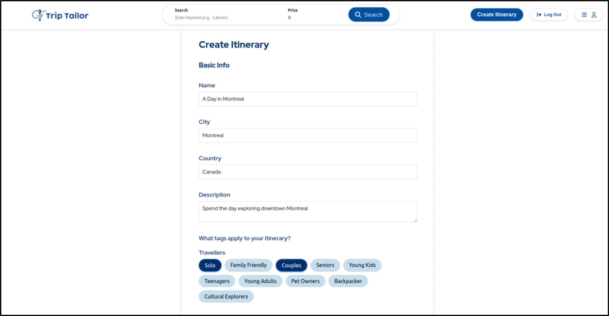

#### Itinerary retrieval

The itinerary service also handles the retrieval of itineraries for both the feed and displaying the user’s posted itineraries. An API was created to request that the backend retrieves itineraries. When a request is made the backend will get the necessary itineraries and send them to the front end for them to be displayed.

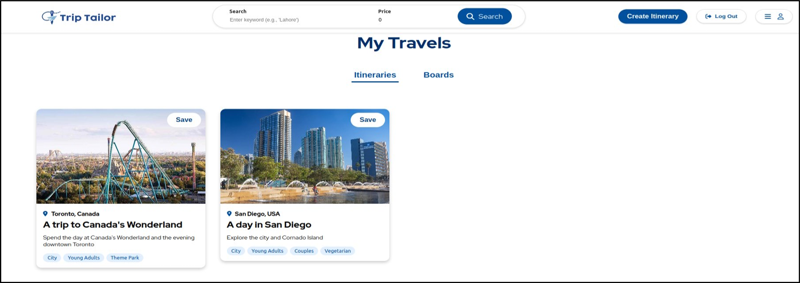

### Feed Service

#### Overview

The feed service is responsible for displaying filtered itineraries based on the users selected tags within the profile creation screen. It will fetch data and update the UI in an organized format, as shown below.

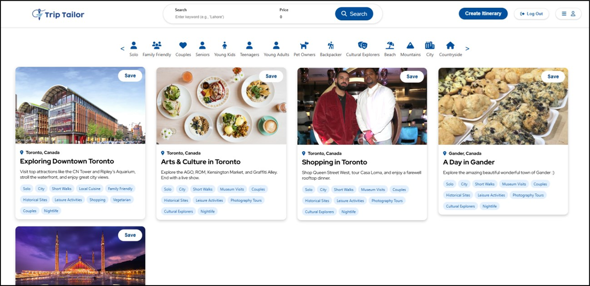

#### Feed Creation

Upon loading into the homepage, the process begins by gathering itineraries from various users via the backend services. Since each itinerary is associated by multiple tags, when the user selects multiple tags (ie “Teenagers” and “Shopping”), the service will filter the itineraries to show only the matching ones related to the users tags.

This is done through a series of API calls to retrieve the users tags, and related itineraries, followed by the data on the front end. Once this is done, the filtered itineraries are then displayed at the front end.

> The feed service will ensure that it remains up to date, even when changing user tags, the feed service will automatically update its filtered itineraries based upon the new tags.
{: .prompt-info}

#### Tag-Based Filtering

Tag-based filtering is a core feature of the feed service. This allows users to customize their experience in TripTailor by selecting specific tags that match their interests. Since each itinerary is associated with more than one tag, you can select multiple tags to filter at the top of the page, shown in figure # in the red box.

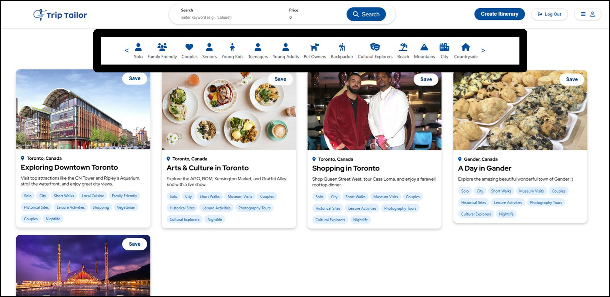

The process starts once the user clicks a tag they want to filter by. which is then added to a list of selected tags. The feed service will then send a request to the backend, with the selectee tags, to then find all the matching itineraries. Once the data is retrieved, the system will update the feed to display only the filtered results.

> If multiple tags are selected, the system will use AND logic to ensure that only the itineraries with all the selected tags are displayed.
{: .prompt-info}

### Search Service

#### Overview

The Search Service is a backend service that is designed to enable users to search for itineraries based on a search bar input, as well as an optional price input.

> The service contains a single endpoint: /search, where users send HTTP GET requests containing their search input.
{: .prompt-info}

The service will then dynamically generate a query to retrieve and rank itineraries based on their relevance to the users search. Building on top of the itinerary data type, the search service uses a ScoredItinerary which is effectively an itinerary with an additional attribute called TotalMatchScore to provide users with itineraries that are most relevant to their search.

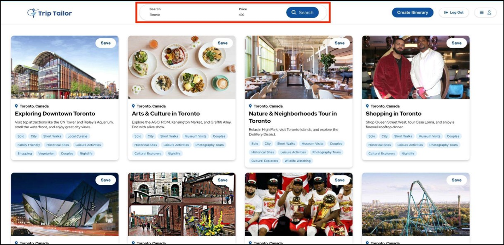

#### Functionality and Querying Process

The query building process begins by comparing the entire search string against the ‘Title’ field in the itineraries table, to look for exact matches to the search.

This is the highest weighted match and will give the largest increase to the total match score. Then, the search string is tokenized, essentially breaking the string down into individual words or sub-strings separated by spaces.

Each token will then be compared against the ‘Title’ field again for partial matches, as well as the City, Country, Username, Tags, and Languages fields.

> Each match in any of these comparisons between token and field will contribute to the total match score. Any itineraries with TotalMatchScore less than 2 will be excluded from the results.
{: .prompt-info}

> Results are sorted in descending order of TotalMatchScore from highest to lowest. The price input acts as a filtering condition meaning that any itineraries with price greater than user specified amount will be excluded from the results.
{: .prompt-info}

> Once the query is constructed, it is executed against the PostgreSQL database. The service retrieves the results, which include the itinerary details and the calculated score.
{: .prompt-info}

> These results are then formatted as JSON and returned to the frontend. This design allows users to explore itineraries intuitively, allowing flexibility with their search and yielding results that closely match their input.
{: .prompt-tip}

### Save Service

#### Overview

The Save Service is a dedicated backend service designed to manage all board-related operations within the application. It provides a set of RESTful endpoints for handling boards, posts, itineraries, and events.

Built using the Gin framework in Go, this service interacts with the PostgreSQL database to retrieve, modify, and manage data related to user-saved content, such as boards and their associated posts.

#### Core Functionality

The Save Service focuses on providing comprehensive support for managing boards, which serve as user-curated collections of posts and itineraries.

It includes operations such as retrieving boards, adding posts to boards, editing board details, and deleting boards or disassociating individual posts from them. These functionalities enable users to personalize their experience by organizing content in a way that suits their preferences.

Pressing `Save` allows us to save the Itinerary to either an existing, or new Board, as seen below:

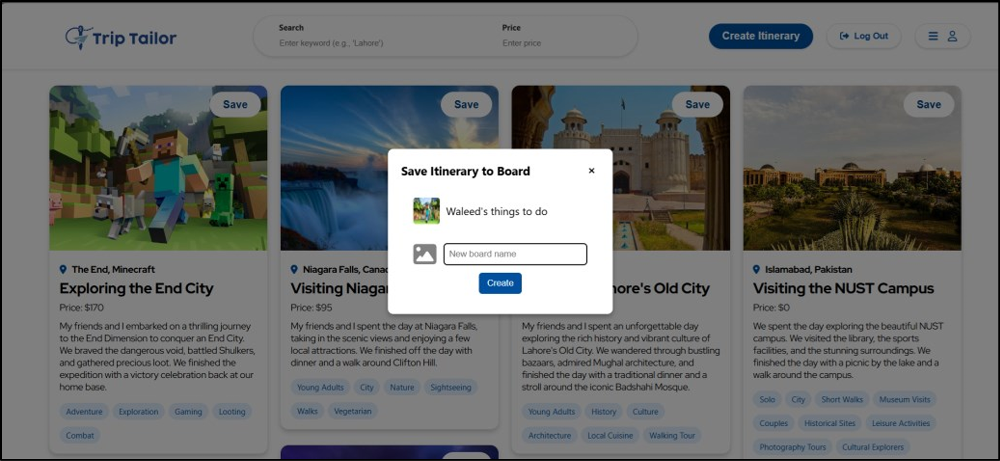

This results in:

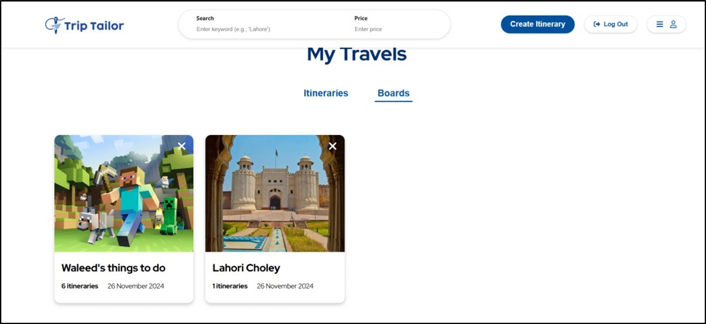

#### Endpoints and Functionalities

The Save Service exposes several RESTful API endpoints, each designed to perform specific tasks. These endpoints are registered through the RegisterRoutes function, which binds them to their corresponding handler functions.

> The Save Service registers HTTP handlers for all its endpoints and starts the HTTP server on port 8086.
{: .prompt-info}

##### Retrieval Operations

| Endpoint       | Description                                                                                       |
|----------------|---------------------------------------------------------------------------------------------------|
| `GET /boards`  | Fetches boards associated with a specific user, identified by their username. This endpoint allows users to view all their curated collections. |
| `GET /posts`   | Returns posts linked to a particular board, identified by boardId. This enables users to view all content within a specific board. |
| `GET /itineraries` | Retrieves the itinerary linked to a given postId, providing detailed information about the itinerary associated with the post. |
| `GET /events`  | Fetches events related to a specific itinerary, identified by itineraryId. This allows users to explore activities linked to their saved itineraries. |

##### Modification and Deletion Operations

| Endpoint                                | Description                                                                                       |
|-----------------------------------------|---------------------------------------------------------------------------------------------------|
| `DELETE /boards/:boardId/posts/:postId` | Removes a specific post from a board. This endpoint helps users curate their collections by removing unwanted content. |
| `DELETE /boards/:boardId`               | Deletes an entire board, allowing users to declutter their saved content.                          |

##### Creation and Update Operations

| Endpoint          | Description                                                                                       |
|-------------------|---------------------------------------------------------------------------------------------------|
| `POST /addboard`  | Adds a new board to the database. Users can create new collections to organize their saved content effectively. |
| `POST /addboardpost` | Adds a specific post to an existing board. This enables users to populate their boards with relevant content. |
| `POST /editboard` | Updates the name and description of an existing board. This feature allows users to personalize and update their collections as needed. |

## Design principles

### Single Responsibility Principle (SRP)

Each microservice in TripTailor is designed to handle a single, well-defined responsibility. For example, the Authentication Service handles user sign-in and sign-up, while the Profile Service is dedicated to managing user profiles. This modular approach prevents a service from becoming overly complex and simplifies maintenance and updates.

By adhering to SRP, the code within each microservice is focused and easier to read, making it straightforward for new developers to understand the logic and make modifications without unintended side effects.

### Liskov Substitution Principle (LSP)

Substitution of Components: TripTailor ensures that subclasses or derived services can replace their parent classes or services without affecting the behavior of the application. For instance, if a new implementation of a service is developed to handle a specific task more efficiently, it can be swapped in without altering the rest of the system.

> The design allows various components, such as the Search Service and Feed Service, to interact with each other smoothly. This principle is particularly important for maintaining the integrity of data flow across services and ensuring that code modifications do not introduce inconsistencies.
{: .prompt-tip }

### Dependency Inversion Principle (DIP)

Decoupled Services: TripTailor’s backend architecture promotes a high level of decoupling between services, following the DIP by depending on abstractions (e.g., interfaces) rather than concrete implementations. For example, the Save Service can be extended or replaced with minimal changes, as it interacts with higher-level data access layers instead of direct database calls.

> The application uses dependency injection to manage dependencies between services, allowing for easier testing and more flexible configurations. This approach supports the construction of mock services during development and testing, aiding in more robust code quality and application resilience.
{: .prompt-tip }

### Open/Closed Principle (OCP)

Extensibility without Modification: The application is designed so that new functionality can be added without changing existing code. For example, new itinerary features or additional user attributes can be introduced by adding new services or expanding existing ones with minimal disruption.

> Each microservice operates independently, which aligns with OCP by allowing for the addition of new endpoints or services without altering the existing ones. This practice ensures that the platform can evolve as the user needs change or as new technologies emerge.
{: .prompt-tip }

### Interface Segregation Principle (ISP)

Focused Interfaces: The design avoids "fat" interfaces that force components to implement unnecessary methods. Each service in TripTailor exposes endpoints that are specific to its functionality, and these are designed to meet the precise needs of their respective clients. This minimizes the impact of changes and simplifies the integration process.

> By keeping interfaces specialized, developers working with each service can work more efficiently, understanding only the relevant parts of the API without being burdened by unrelated methods or complex interactions.
{: .prompt-tip }

## Challenges

Developing TripTailor involved overcoming a variety of challenges across the database, backend, and frontend layers. Each part of the system required addressing specific obstacles to ensure a seamless, efficient, and scalable application. Here is a summary of the main challenges and how they were tackled:

### Database Challenges

**Data Consistency and Synchronization**
: One of the main challenges in building TripTailor was ensuring data consistency across the various microservices that needed access to shared data.

> This required careful planning for data replication and synchronization, especially when dealing with user profiles and itineraries that could be modified by multiple services simultaneously.
{: .prompt-tip }

**Complex Queries**
: Services like the Search Service demanded complex queries to pull and process data efficiently.

> We solved this by using well-indexed database tables and designing efficient data models that could handle diverse and concurrent query loads without bottlenecks.
{: .prompt-info }

### Backend Challenges

**Microservices Communication**
: A core challenge was establishing reliable communication between microservices, particularly when handling requests that required data from multiple sources.

**Service Orchestration**
: Managing the flow of data and ensuring proper orchestration across services was complex.

> The solution involved integrating API gateways and developing a robust service registry to handle service discovery, versioning, and request routing effectively.
{: .prompt-tip }

**Error Handling and Fault Tolerance**
: Ensuring the system could gracefully recover from failures was a significant challenge.

> We implemented fallback mechanisms and retry policies to handle service failures and prevent cascading errors across the platform.
{: .prompt-info }

### Frontend Challenges

**User Experience Consistency**
: Designing an interface that worked seamlessly across different devices was challenging.

> We used responsive design principles along with frameworks like React to create a consistent experience.
{: .prompt-info }

> Testing across various screen sizes and devices was crucial for ensuring accessibility and user satisfaction.
{: .prompt-tip}

**State Management**
: Handling state efficiently in a single-page application (SPA) was another challenge.

> We chose to use state management libraries like Redux to manage the complex state of user interactions, itinerary updates, and live feed updates, which required synchronization with backend services.
{: .prompt-info }

---

These challenges were met with a combination of strategic planning, technology selection, and rigorous testing, resulting in a robust and scalable application.

> TripTailor’s success was defined by the seamless interaction between database management, backend service orchestration, and frontend user interface design, all working in harmony to deliver a top-notch user experience.
{: .prompt-tip}

## Conclusion

Developing TripTailor was a multifaceted process that required careful planning and execution at every stage. By applying sound design principles, adhering to SOLID architecture, and addressing challenges across the database, backend, and frontend, we were able to create a cohesive and user-friendly platform.

From ensuring data consistency and seamless microservice communication to building a responsive interface that performs well across devices, each decision played a critical role in shaping the final product.

The project not only highlighted the importance of a well-structured system architecture and efficient data handling but also underscored the value of collaboration among development teams to tackle complex technical challenges.

Through iterative development, rigorous testing, and adopting the right technologies, TripTailor became a scalable, secure, and high-performance solution tailored for modern travel planning.

In conclusion, the experience gained from designing and building TripTailor has enriched our understanding of building large-scale applications and provided insights into balancing user needs with technical feasibility. It stands as a testament to how a well-executed blend of thoughtful design, robust backend development, and polished frontend interfaces can create an application that users trust and enjoy.

> Thank you very much :)

> [Here's](../assets/docs/projects/triptailor/Final Group Report - TripTailor.pdf) a downloadable version of the above
{: .prompt-info }